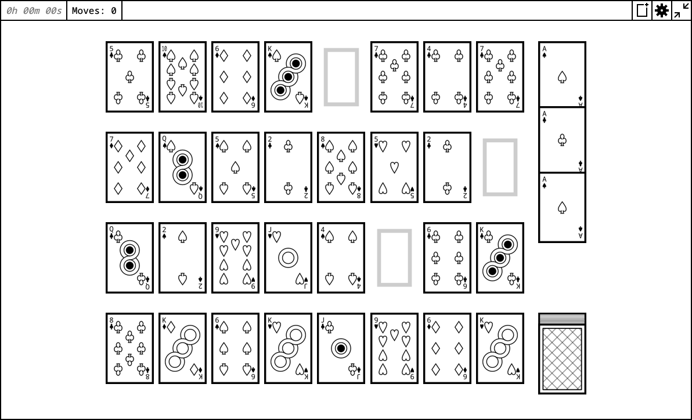
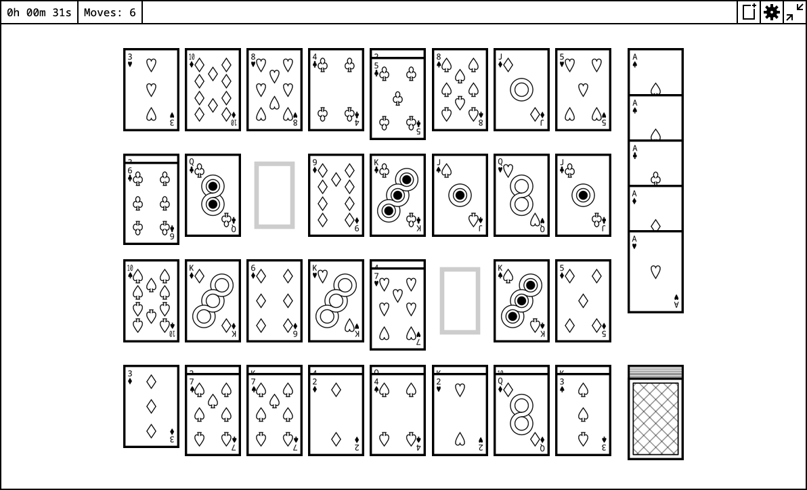
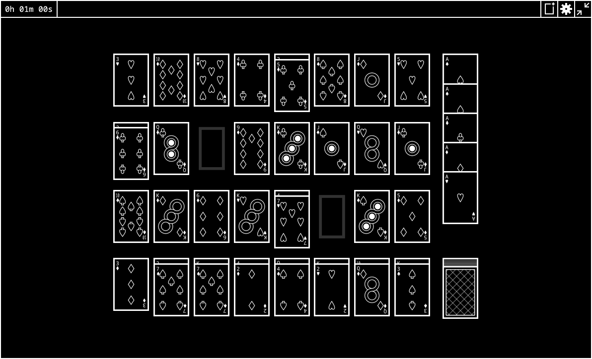

# Mod3 Solitaire, on web

||||
|---|---|---|

Basic Solitaire engine (done via hacky sveltekit) with [Mod3 ruleset](https://docs.kde.org/stable_kf6/en/kpat/kpat/rules-specific.html#mod3).

Made as [the best solitaire (kpat) containing Mod3](https://apps.kde.org/en-gb/kpat/) doesn't have easily accessible builds for all platforms and systems. Web solves this problem (badly)!

Touch input support is only partial. Releasing touches do not trigger correctly, and is a known bug with the implementation.